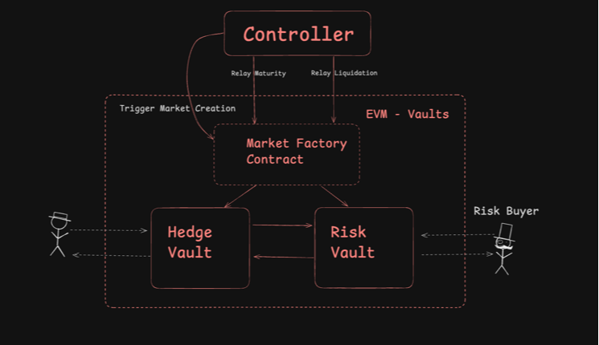
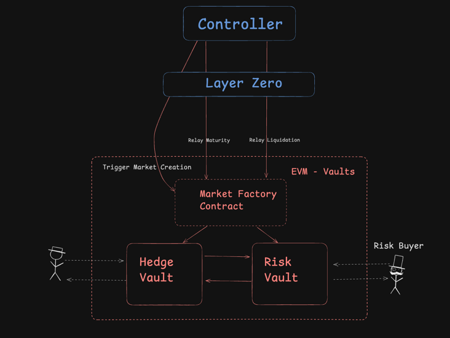

# Risk Relay

## What is it?

**RiskRelay** is an omnichain decentralized hedge and risk management protocol built on ERC-4626 standard vaults across EVM-compatible chains. This initiative aims to assess the feasibility of a cross-chain protocol that uses generalized bridges like LayerZero, Hyperlane, and Chainlink's CCIP for message passing. The protocol taps into each chain's unique strengths: for example, Flare offers inbuilt Oracle solutions, Base provides liquidity, and Fhenix and Inco allow for shielded bets. 

By developing modular components with standardized interfaces, RiskRelay is versatile enough to serve not only as a risk management solution but also as a foundation for applications in insurance, betting, and prediction markets. We will explore several of these use cases throughout this project.

#### Please Note:
This project builds upon the foundational concepts and architecture explored in an earlier prototype on Near Protocol during Near’s Redacted Hackathon. However, RiskRelay (OmniBets V2) is a distinct and independent project, not simply an extension of the original. This new iteration explores new bridging(message passing) technologies such as LayerZero, Chainlink's CCIP, and Hyperlane, and targets a diverse set of new chains. Developed exclusively for this hackathon, RiskRelay explores the potential of cross-chain functionality on a much broader scale.

For full transparency you can see the first attempt here: https://github.com/enderNakamoto/omnibets

## Same Chain Controller 

### Pyth Oracle

#### Mantle: 

* https://explorer.sepolia.mantle.xyz/address/0x18975871ab7e57e0f26fdf429592238541051fb0

* https://explorer.sepolia.mantle.xyz/address/0x30ccf5c0ea4f871398136dd643a0544aba39b26d    

* https://explorer.sepolia.mantle.xyz/address/0x981beecd15b05a35206cfc44af12373b45613e71

#### Morph: 

* https://explorer-api-holesky.morphl2.io/address/0x18975871ab7e57e0f26fdf429592238541051fb0

* https://explorer-api-holesky.morphl2.io/address/0x981beecd15b05a35206cfc44af12373b45613e71

#### Linea 

* https://sepolia.lineascan.build/address/0x30ccf5c0ea4f871398136dd643a0544aba39b26d

* https://sepolia.lineascan.build/address/0x981beecd15b05a35206cfc44af12373b45613e71

* https://sepolia.lineascan.build/address/0x3e65cabb59773a7d21132daaa587e7fc777d427c

## Multi Chain Controller w/ Layer Zero

