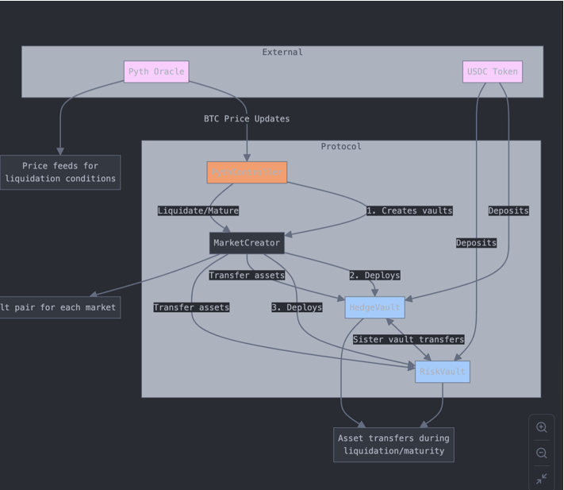
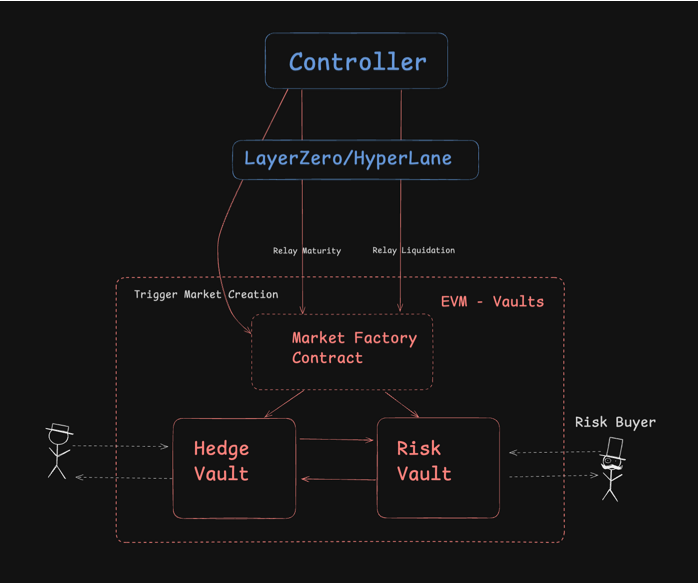

# Risk Relay

This is a Omnichain EVM project that implements a decentralized risk markets system to hedge against unfortunate things. The system consists of four main components:

* **MarketCreator**: This contract is responsible for creating and managing risk and hedge vaults for each market.
* **RiskVault**: This contract represents the "risk" side of a market, where users can deposit funds to take on risk.
* **HedgeVault**: This contract represents the "hedge" side of a market, where users can deposit funds to hedge against the risks.
* **Controller** This contract gets data from Oracle and either matures or liquidates the vaults.

### Architecture Overview
The architecture of this project is designed to facilitate the creation and management of risk markets, where users can Underwrite (Invest in Insurance/Provide Liquidity) or Hedge against various types of risks.

#### MarketCreator

The `MarketCreator` contract is the entry point for the system. It has the following responsibilities:

1. **Market Creation**: The `createMarketVaults()` function allows the creation of a new risk and hedge vault pair for a given market.

2. **Market Lookup**: The `getVaults()` function allows retrieving the addresses of the risk and hedge vaults for a given market.

The `MarketCreator` contract maintains a mapping of market IDs to the corresponding risk and hedge vault addresses.

#### RiskVault and HedgeVault

The `RiskVault` and `HedgeVault` contracts represent the "risk" and "hedge" sides of a market, respectively. They share a similar structure and functionality:

1. **Deposit and Withdrawal**: Users can deposit funds into the vaults and withdraw their shares later.

2. **Asset Transfer**: The vaults can only transfer assets to their "sister" vault, as controlled by the MarketCreator contract.

3. **Ownership**: The HedgeVault contract has an owner, which is the MarketCreator contract.

The vaults inherit from the **ERC4626** standard, which provides a standard interface for tokenized vaults.

The tests provided in the project demonstrate the expected usage and behavior of the system.

## Same Chain Protocol - Simplest Version

## Multi Chain Controller w/ Layer Zero

## Deployed Contyracts - 

#### Mantle with Pyth Oracle

* https://explorer.sepolia.mantle.xyz/address/0x18975871ab7e57e0f26fdf429592238541051fb0

* https://explorer.sepolia.mantle.xyz/address/0x30ccf5c0ea4f871398136dd643a0544aba39b26d    

* https://explorer.sepolia.mantle.xyz/address/0x981beecd15b05a35206cfc44af12373b45613e71

#### Morph with Pyth Oracle

* https://explorer-api-holesky.morphl2.io/address/0x18975871ab7e57e0f26fdf429592238541051fb0

* https://explorer-api-holesky.morphl2.io/address/0x981beecd15b05a35206cfc44af12373b45613e71

#### Linea with Pyth Oracle

* https://sepolia.lineascan.build/address/0x30ccf5c0ea4f871398136dd643a0544aba39b26d

* https://sepolia.lineascan.build/address/0x981beecd15b05a35206cfc44af12373b45613e71

* https://sepolia.lineascan.build/address/0x3e65cabb59773a7d21132daaa587e7fc777d427c

### Flare with FTSO Oracle

* https://coston2.testnet.flarescan.com/address/0x18975871ab7E57e0f26fdF429592238541051Fb0

* https://coston2.testnet.flarescan.com/token/0x30CCF5C0Ea4F871398136DD643A0544Aba39b26D

* https://coston2.testnet.flarescan.com/address/0x981BeeCd15b05A35206cfc44af12373B45613E71

## Multi Chain Controller w/ Layer Zero

